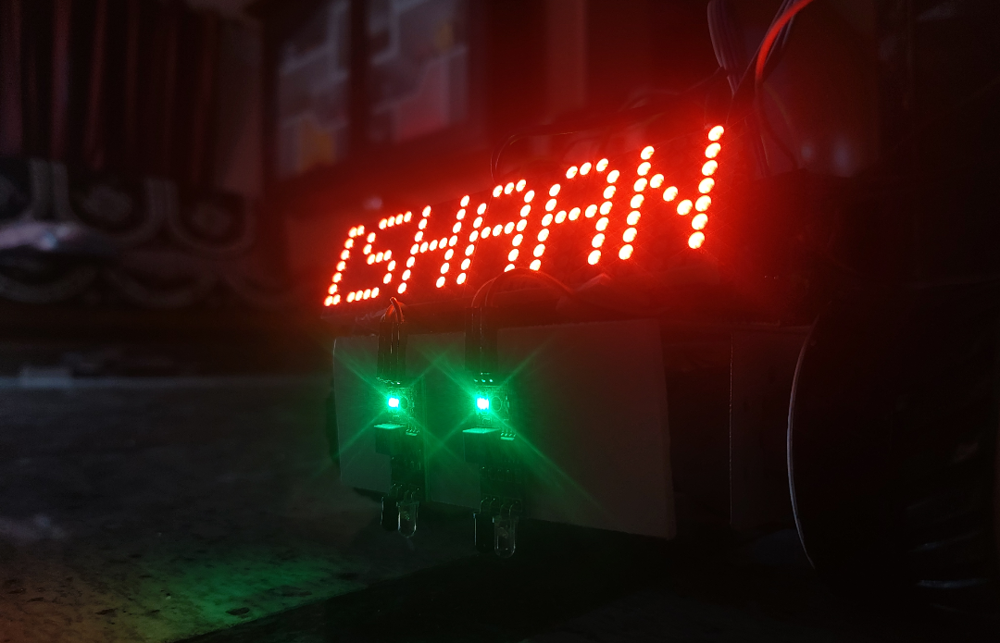
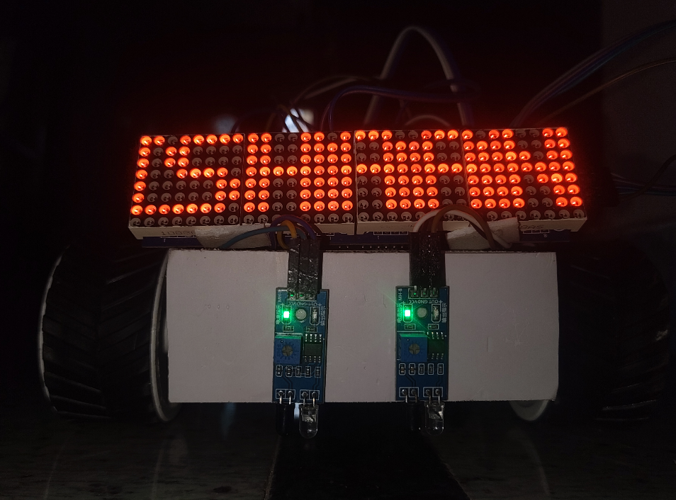
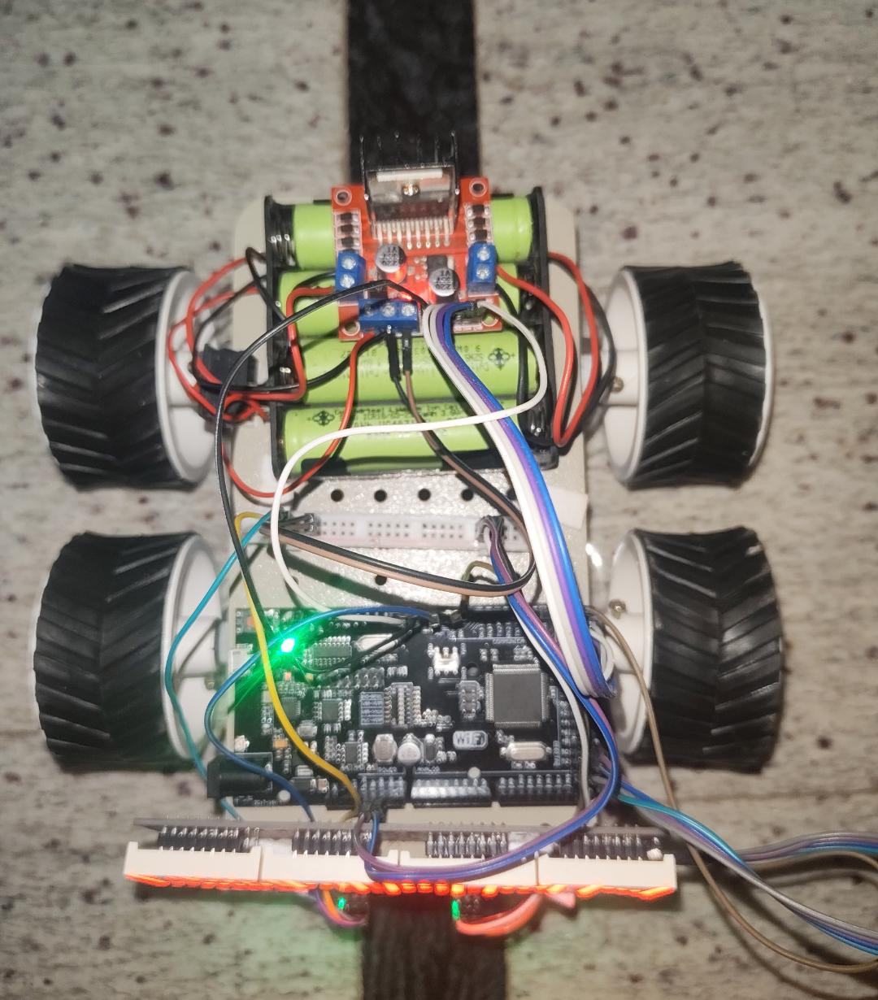
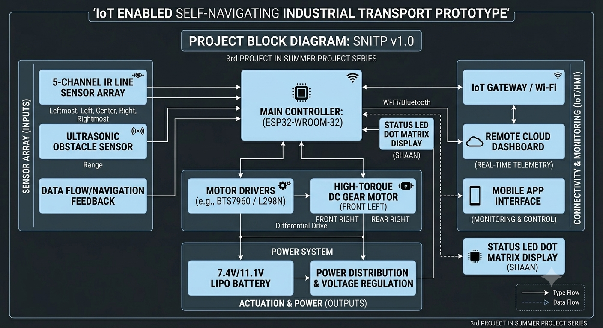

# AegisMove IoT: Precision-Guided Autonomous Logistics Prototype 🚀

Welcome to the official repository for **AegisMove IoT** (SNITP v1.0). This repository houses the production-ready firmware, structural layout logic, and system architecture for an advanced, IoT-enabled Automated Guided Vehicle (AGV) prototype tailored for modern industrial warehouse environments. 

This development marks the **3rd project in my summer project series**, shifting focus from basic hobbyist robotics to structural, dual-core firmware design, precision movement controls, and hazard mitigation logic.


---

## 📑 Project Overview

AegisMove IoT addresses the core execution needs of **Industry 4.0** material handling. Built on a multi-wheel high-torque drive platform, the vehicle handles path navigation, live tracking feedback, obstacle avoidance mechanisms, and wireless connectivity status pipelines simultaneously.

### Key Functional Blocks:
* **Asynchronous Matrix Pipeline:** Separates intensive UI display rendering from raw physical motor manipulation loops.
* **Closed-Loop Line Correction:** Shifts away from rigid if/else routines to implement smooth, continuous PID tracking adjustments.
* **Fail-Safe Processing:** Real-time distance mapping overrides navigation loops instantly to protect machinery and simulated cargo payloads.

---

## 🛠️ System Architecture & Block Diagram

The project splits hardware operations into distinct logic zones coordinated across an embedded microcontroller architecture:

# AegisMove-IoT-Precision-Guided-Autonomous-Logistics-Prototype
AegisMove IoT is a functional prototype of a Self-Navigating Industrial Transport Vehicle (AGV) engineered for smart warehouse and factory automation frameworks. Controlled by an ESP32 microcontroller utilizing dual-core processing, the system processes a high-precision PID-tuned 5-channel infrared sensor array to achieve seamless line tracking.

## ⚡ Technical Feature Breakdown

* **Dual-Core FreeRTOS Partitioning:** Driving continuous pixel manipulation across a 4-panel MAX7219 matrix takes significant clock processing cycles. To eliminate path-tracking latency, the LED matrix rendering task is pinned entirely to **ESP32 Core 0**, isolating its processing from the time-critical PID path routines running uninhibited on **Core 1**.
* **Mathematical PID Line Navigation:** Utilizes a weighted average calculation across a 5-channel digital IR sensor line array. The software dynamically calculates error deviations, feeding a Proportional-Integral-Derivative equation to adjust motor speeds smoothly and avoid tracking overshoots.
* **Anti-Windup Integral Safe-Guards:** To prevent vehicle lunges or motor over-saturation when starting from a full halt or handling payload placement delays, the accumulated internal PID correction variable is restricted tightly using dedicated ceiling constraints.
* **Industrial Safety Interruption:** An ultrasonic module tracks front-facing range clearances. If an obstacle breaks the `SAFETY_STOP_DISTANCE_CM` threshold, a fail-safe function instantly zeroes the motor PWM registers and flushes the PID error matrices to prevent sudden acceleration spikes when the path clears.

---
## Images 



## Block Diagram 



## 🔧 Component Configuration Map

| Hardware Component | Function / Subsystem | Primary Interface / Connection |
| :--- | :--- | :--- |
| **ESP32-WROOM-32** | Central Microcontroller Node | Core Logic & Wi-Fi Gateway |
| **5-Channel IR Array** | High-Precision Line Tracking Array | GPIOs 34, 35, 32, 33, 25 |
| **MAX7219 Dot Matrix** | Dynamic Visual Telemetry Display | Hardware SPI (GPIO 5 CS, 18 CLK, 23 DIN) |
| **HC-SR04 Module** | Ultrasonic Range Hazard Detection | GPIO 26 (Trig) / GPIO 27 (Echo) |
| **BTS7960 H-Bridge** | Heavy-Duty High-Current Motor Driver | PWM Pin Outbound Controls |

---

## 🚀 Setup, Calibration, and Deployment

### 1. Library Dependencies
Ensure the following frameworks are installed inside your Arduino IDE ecosystem prior to deployment:
* `Adafruit_GFX`
* `Max72xxPanel` (by Mark Ruys)

### 2. Tuning PID Constants
Depending on your platform mass, friction coefficient, and battery configuration, you will need to adjust the following tuning parameters at the top of the firmware file:
```cpp
const float Kp = 45.0;   // Increase for snappier corrections; decrease if fish-tailing occurs
const float Ki = 0.05;   // Adjust carefully to smooth out long-term drift tendencies
const float Kd = 25.0;   // Increase to counteract dampening oscillations over time
